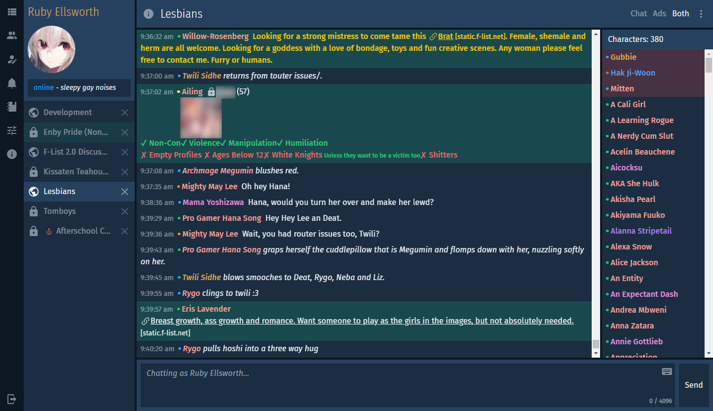
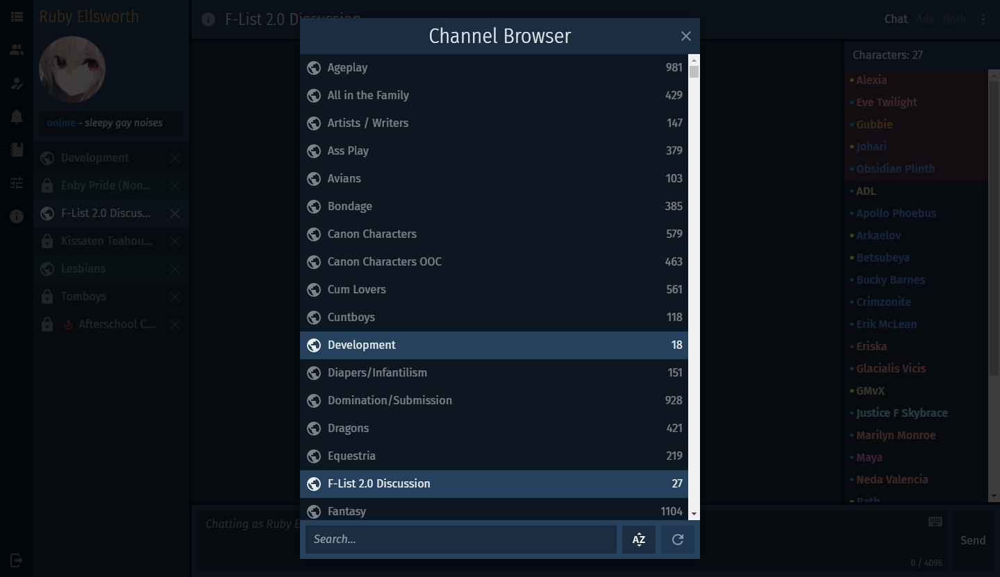
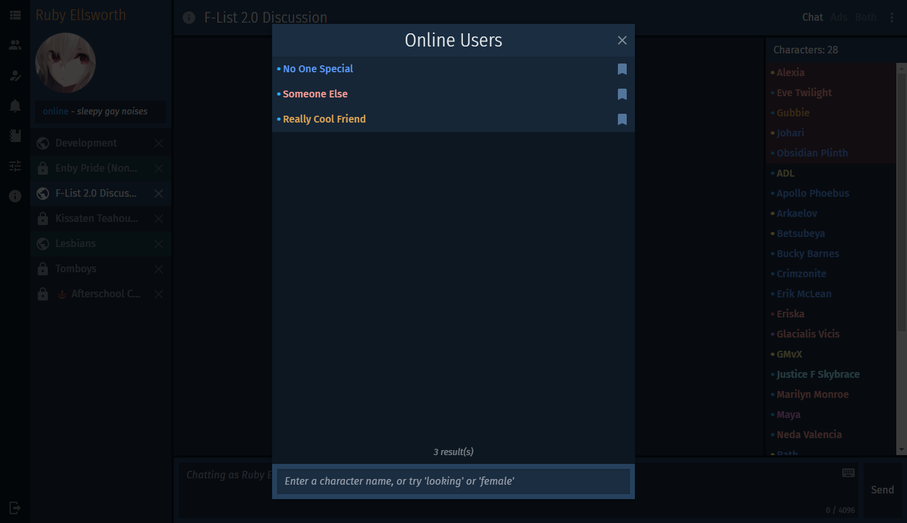
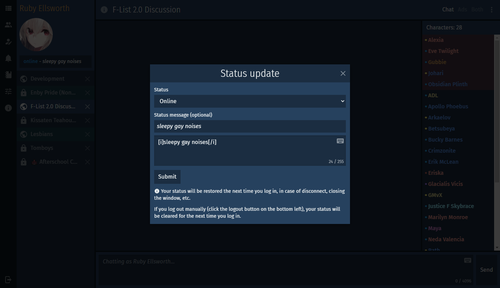
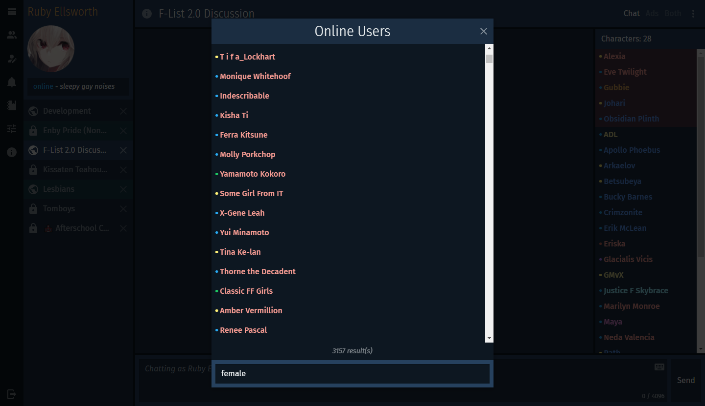
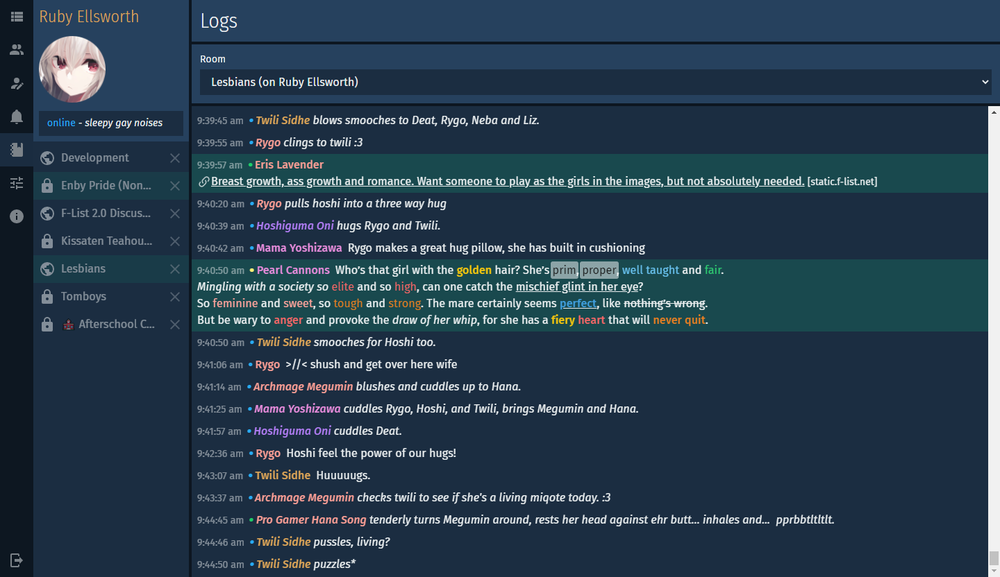
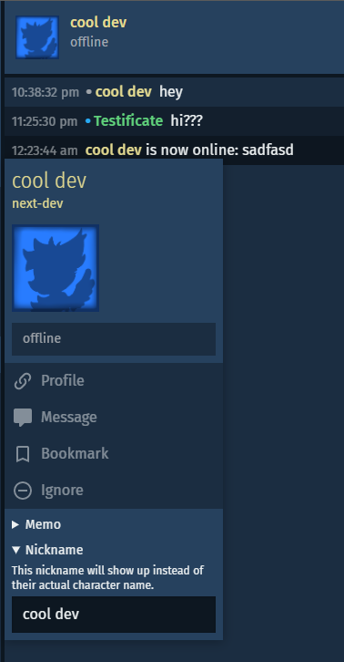
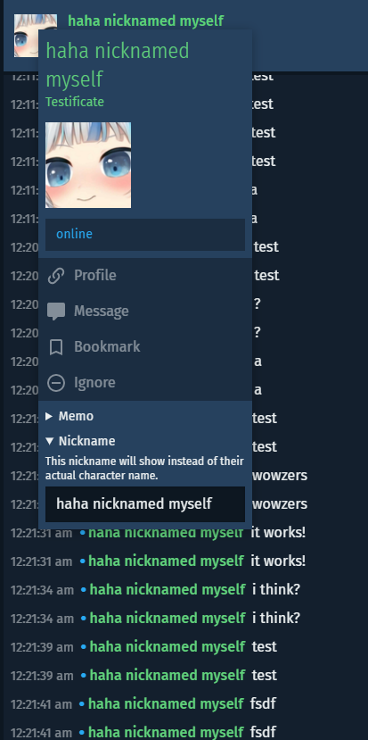

# next

**next** (lowercase n!) is made of specific features and changes I've personally wanted in an F-Chat client. It's my dream client, more or less.

Just a taste of what's added or changed:

- An overall cleaner, more modern-looking look, with pretty animations and transitions ✨
- Replacing console and slash commands with UI interactions (where it makes sense)
- Channels and private chats are saved and restored automatically; no more manual pinning
- Right click on a character to see which characters of yours they're friended with
- Inline, easier-to-access character memos right from the menu
- **Very performant** searching through channels and all online characters
- Locally nicknaming characters
- Other stuff

Don't like any of this? Keep using the 3.0 client c:

Currently it's a **heavy** work in progress; there will probably be bugs and some missing features. Test at your own risk. If you have suggestions or bug reports, join the Discord server, or send a note to [next-dev](https://www.f-list.net/c/next-dev/) on F-List.

- [Discord](https://discord.gg/p5z7YvwQ8p)
- [Trello](https://trello.com/b/Ju08Edyn/next)
- [Changelog](./CHANGELOG.md)

  
Screenshot Gallery

